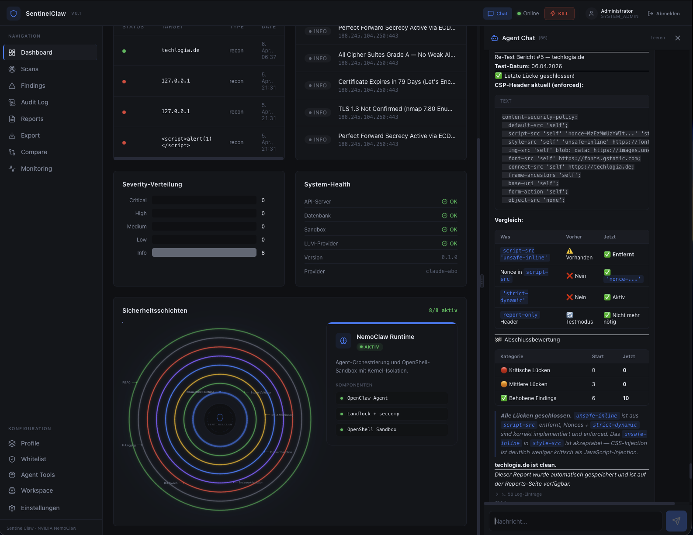

# SentinelClaw

<p align="center">
  
</p>

> KI-gestützte Security Assessment Platform — angetrieben von [NVIDIA NemoClaw](https://docs.nvidia.com/nemoclaw/latest/), OpenClaw und Claude

Self-hosted Penetrationstest-Plattform mit autonomen Agenten, Kernel-Level-Sandbox-Isolation und einer 8-Schichten-Sicherheitsarchitektur. Kombiniert die Sicherheitsgarantien von NemoClaw mit einem vollständigen Pentest-Arsenal (47 Tools, Stufe 0-4) und einer Web-UI mit 57 konfigurierbaren Einstellungen.



*Dashboard mit 8/8 Sicherheitsschichten aktiv, System-Health, Findings und Agent-Chat — Re-Test-Bericht für techlogia.de*

---

## Warum NemoClaw und nicht OpenClaw alleine?

OpenClaw alleine gibt dem Agent **uneingeschränkten Shell-Zugriff** (`Bash(*)`). Das reicht für Entwicklung, aber **nicht für ein Firmenumfeld**. SentinelClaw nutzt NemoClaw als Sicherheitsmantel um OpenClaw:

| | OpenClaw alleine | SentinelClaw + NemoClaw |
|---|---|---|
| **Shell-Zugriff** | `Bash(*)` — alles erlaubt | Bash-Allowlist — nur freigegebene Binaries |
| **Tool-Installation** | Agent kann `pip install` frei ausführen | Blockiert — nur Admin über Web-UI |
| **Sandbox-Isolation** | Keine (läuft auf dem Host) | [OpenShell Kernel-Isolation](https://docs.nvidia.com/nemoclaw/latest/security/best-practices.html) (Landlock + seccomp) |
| **Netzwerk** | Uneingeschränkt | [Deny-by-Default Policy](https://docs.nvidia.com/nemoclaw/latest/network-policy/customize-network-policy.html) |
| **Credential-Schutz** | API-Keys im Prozess sichtbar | [Credential-Isolation](https://docs.nvidia.com/nemoclaw/latest/security/best-practices.html) — Keys nie in der Sandbox |
| **Eskalationskontrolle** | Keine | 5-Stufen-System mit Genehmigungspflicht ab Stufe 3 |
| **Forbidden Actions** | Keine | DoS, Ransomware, Massen-Exfiltration immer blockiert |
| **Kill-Switch** | Keiner | 4 unabhängige Kill-Pfade (<1s bis <5s) |
| **Konfiguration** | Code-Änderung nötig | 57 Settings über Web-UI, kein Code nötig |
| **DSGVO** | Nicht vorhanden | Datenexport, Cascade-Löschung, Retention, Consent |

**Kurzfassung:** OpenClaw ist der Motor. NemoClaw ist die Sicherheitshülle. SentinelClaw ist das Cockpit.

> Dokumentation: [docs.nvidia.com/nemoclaw](https://docs.nvidia.com/nemoclaw/latest/) | [Security Best Practices](https://docs.nvidia.com/nemoclaw/latest/security/best-practices.html) | [Sandbox Hardening](https://docs.nvidia.com/nemoclaw/latest/deployment/sandbox-hardening.html) | [Network Policy](https://docs.nvidia.com/nemoclaw/latest/network-policy/customize-network-policy.html) | [CLI-Referenz](https://docs.nvidia.com/nemoclaw/latest/reference/commands.html)

---

## Wie SentinelClaw arbeitet

### Architektur-Überblick

```
┌─────────────────────────────────────────────────────────────────┐
│  SentinelClaw Web-UI (React + TypeScript)                       │
│  Dashboard, Scans, Findings, Reports, Chat, Einstellungen       │
└────────────────────────┬────────────────────────────────────────┘
                         │ HTTPS + WebSocket (HttpOnly Cookies)
                         ▼
┌─────────────────────────────────────────────────────────────────┐
│  SentinelClaw API  (FastAPI, Python 3.12+)                      │
│  Auth (JWT+CSRF) │ RBAC (5 Rollen) │ Rate-Limiting │ Audit     │
│  8 Sicherheitsschichten müssen ALLE aktiv sein                  │
└────────────────────────┬────────────────────────────────────────┘
                         │ SSH über OpenShell Proxy
                         ▼
┌─────────────────────────────────────────────────────────────────┐
│  NVIDIA NemoClaw  (Agent-Runtime)                               │
│                                                                 │
│  ┌───────────────────────────────────────────────────────────┐  │
│  │  OpenClaw — Agent mit Bash-Allowlist (NICHT Bash(*))      │  │
│  │  Claude als LLM │ sentinelclaw Agent │ Tool-Bridge        │  │
│  └───────────────────────────────────────────────────────────┘  │
│                                                                 │
│  ┌───────────────────────────────────────────────────────────┐  │
│  │  OpenShell — Kernel-Level Sandbox                         │  │
│  │  Landlock LSM │ Seccomp BPF │ Network Namespaces          │  │
│  │  cap_drop ALL │ read-only FS │ Credential-Isolation       │  │
│  └───────────────────────────────────────────────────────────┘  │
└────────────────────────┬────────────────────────────────────────┘
                         │ docker exec (parametrisiert, kein shell=True)
                         ▼
┌─────────────────────────────────────────────────────────────────┐
│  Docker Sandbox-Container                                       │
│  47 Tools (nmap, nuclei, metasploit, hydra, john, linpeas...)   │
│  non-root │ PID-Limit │ Memory-Limit │ NET_RAW only             │
└─────────────────────────────────────────────────────────────────┘
```

### Der Scan-Flow

1. **Benutzer startet Scan** (Web-UI) mit Ziel und Profil
2. **API prüft alle 8 Sicherheitsschichten** — Scan wird blockiert wenn eine fehlt
3. **Orchestrator erstellt Plan** (mindestens 2 Phasen: Recon → Vuln-Assessment)
4. **Bei Eskalationsstufe 3+**: Approval-Request an Admin — Scan pausiert bis genehmigt
5. **NemoClaw Runtime** verbindet per SSH → OpenShell → OpenClaw Sandbox
6. **Agent (Claude) arbeitet autonom**: Wählt Tools, führt Befehle aus, analysiert Ergebnisse
7. **Scope-Validator prüft jeden Tool-Aufruf** (8 Checks: Target, Port, Eskalation, Zeitfenster, Forbidden Actions...)
8. **Ergebnisse**: Findings in DB → Findings-Seite, Reports als Markdown + PDF, Audit-Log

### Der Chat-Agent

Der Agent-Chat in der Web-UI nutzt denselben NemoClaw-Stack:

- Benutzer schreibt Nachricht → Agent entscheidet autonom welche Tools er nutzt
- Agent kann scannen, analysieren, Reports erstellen — alles in der Sandbox
- Gefundene Schwachstellen werden automatisch als Findings extrahiert und auf der Findings-Seite angezeigt
- Tool-Aufrufe werden als aufklappbare Log-Einträge unter der Agent-Antwort angezeigt
- Approval-Cards erscheinen wenn der Agent Stufe 3+ Tools nutzen will

---

## 8-Schichten-Sicherheitsarchitektur

Kein Scan und kein Agent-Aufruf wird ausgeführt wenn nicht **alle 8 Schichten aktiv** sind:

| # | Schicht | Was sie schützt | Konfigurierbar über |
|---|---|---|---|
| 1 | **NemoClaw Runtime** | Kernel-Isolation (Landlock, seccomp, Namespaces) | Einstellungen → NemoClaw |
| 2 | **Scope-Validator** | 8 Checks vor jedem Tool-Aufruf | Scan-Profile + Whitelist |
| 3 | **Input-Validierung** | Shell-Injection, XSS, Binary-Allowlist | Einstellungen → Agent |
| 4 | **Docker Sandbox** | Container-Härtung (cap_drop, read-only, non-root) | Einstellungen → Sandbox |
| 5 | **Netzwerk-Isolation** | Nur Whitelist-Ziele erreichbar | docker-compose.yml |
| 6 | **Kill-Switch** | 4 unabhängige Stop-Pfade (<1s bis <5s) | Web-UI (roter Button) |
| 7 | **Audit-Logging** | Unveränderliches Append-Only Protokoll | Automatisch |
| 8 | **Auth & RBAC** | JWT HttpOnly Cookies, CSRF, MFA, 5 Rollen | Einstellungen → Sicherheit |

---

## Pentest-Arsenal (47 Tools)

| Stufe | Name | Tools | Genehmigung |
|---|---|---|---|
| 0 | **Passiv** (OSINT) | curl, dig, whois, shodan, censys, theHarvester, sublist3r, dnspython, holehe | Automatisch |
| 1 | **Aktiv** (Recon) | nmap, dirb, sslscan, netcat, socat, wafw00f, sslyze, arjun, dirsearch | Automatisch |
| 2 | **Vulnerability** | nuclei, nikto, wapiti, python-nmap, pyjwt | Automatisch |
| 3 | **Exploitation** | hydra, john, hashcat, metasploit, sqlmap, impacket, crackmapexec, pwncat | **Admin-Genehmigung** |
| 4 | **Post-Exploitation** | linpeas, chisel | **Admin-Genehmigung** |

Vorinstalliert im Docker-Image: 23 Tools. Weitere 24 über Web-UI (Einstellungen → Agent Tools) installierbar.

---

## Enterprise-Features

| Feature | Status | Details |
|---|---|---|
| **DSGVO-Compliance** | Implementiert | Datenexport (Art.15), Cascade-Löschung (Art.17), Retention, Consent, AVV-Warnung |
| **Multi-Tenancy** | Implementiert | Organisationen, org_id auf allen Tabellen, RBAC |
| **Prometheus Monitoring** | Implementiert | GET /metrics — 8 Metrik-Familien |
| **Auto-Backup** | Implementiert | SQLite VACUUM INTO bei jedem Start, Retention konfigurierbar |
| **Passwort-Policy** | Implementiert | 10+ Zeichen, Groß/Klein, Zahl, Sonderzeichen, Blockliste |
| **57 UI-Settings** | Implementiert | 11 Kategorien, Boolean-Toggles, NemoClaw-Doku-Links |
| **Security Headers** | Implementiert | CSP, HSTS, X-Frame-Options, Referrer-Policy, Permissions-Policy |

---

## Voraussetzungen

| Komponente | Version | Hinweis |
|---|---|---|
| Python | 3.12+ | Mit `venv`-Unterstützung |
| Node.js | 20+ | Für das Frontend |
| Docker Desktop | 20.10+ | Muss laufen bevor Scans gestartet werden |
| [NVIDIA NemoClaw](https://docs.nvidia.com/nemoclaw/latest/) | Aktuell | OpenClaw + OpenShell installiert |
| Git | 2.30+ | Für Repository-Klonen |

---

## Schnellstart

```bash
# 1. Repository klonen
git clone https://github.com/antonio-030/SentinatlCraw.git
cd SentinatlCraw

# 2. Backend einrichten
python3 -m venv .venv && source .venv/bin/activate
pip install -e ".[dev]"

# 3. Frontend einrichten
cd frontend && npm install && cd ..

# 4. Umgebungsvariablen konfigurieren
cp .env.example .env
# .env anpassen: SENTINEL_ALLOWED_TARGETS, SENTINEL_JWT_SECRET setzen

# 5. Sandbox-Container bauen und starten
docker compose build sandbox
docker compose up -d sandbox

# 6. Backend starten (Port 3001)
.venv/bin/uvicorn src.api.server:app --host 0.0.0.0 --port 3001

# 7. Frontend starten (Port 5173) — in neuem Terminal
cd frontend && npm run dev
```

Öffne `http://localhost:5173` — Login: `admin@sentinelclaw.local` / `admin`

(Passwort muss bei erstem Login geändert werden — Enterprise Passwort-Policy)

---

## Konfiguration

Alle Einstellungen über Umgebungsvariablen (`SENTINEL_`-Präfix) **oder** die Web-UI (Einstellungen-Seite). Änderungen über die UI wirken sofort und werden im Audit-Log protokolliert.

| Variable | Default | Beschreibung |
|---|---|---|
| `SENTINEL_LLM_PROVIDER` | `claude-abo` | Provider: `claude-abo`, `claude`, `azure`, `ollama` |
| `SENTINEL_ALLOWED_TARGETS` | *(leer)* | Komma-separierte Scan-Ziele |
| `SENTINEL_JWT_SECRET` | *(dev-default)* | JWT-Signatur-Secret (in Produktion setzen!) |
| `SENTINEL_TOKEN_EXPIRE_MINUTES` | `60` | JWT-Token-Lebensdauer |
| `SENTINEL_SESSION_INACTIVITY_MINUTES` | `30` | Auto-Logout bei Inaktivität |
| `SENTINEL_LLM_MAX_TOKENS_PER_SCAN` | `50000` | Token-Budget pro Scan |

Vollständige Liste: siehe `.env.example` und Web-UI → Einstellungen (57 Optionen in 11 Kategorien)

---

## Tests

```bash
# 253 Unit-Tests
.venv/bin/python -m pytest tests/unit/ -v

# E2E-Tests (Scan, Kill-Switch, Scope)
.venv/bin/python -m pytest tests/e2e/ -v

# Frontend TypeScript-Check
cd frontend && npx tsc --noEmit
```

---

## Projektstruktur

```
src/
├── api/            # FastAPI REST-API (17 Route-Dateien, system_routes.py, gdpr_routes.py, org_routes.py)
├── agents/         # NemoClaw Runtime, Chat-Agent, LLM-Provider, Token-Tracker
├── orchestrator/   # Scan-Orchestrierung (Multi-Phase, 4 Phasen)
├── shared/         # DB, Auth, Config, Scope-Validator, Kill-Switch, DSGVO, Backup, Settings
├── sandbox/        # Docker-Sandbox-Executor
├── watchdog/       # Unabhängiger Watchdog-Prozess
├── mcp_server/     # MCP Tool-Bridge (port_scan, vuln_scan, exec_command)
frontend/src/
├── pages/          # 19 Seiten (Dashboard, Scans, Findings, Reports, Settings, DSGVO, ...)
├── components/     # Chat, Dashboard (SecurityShield), Layout, Reports
├── hooks/          # useApi, useWebSocket
└── services/       # API-Client mit Cookie-Auth + CSRF
```

---

## Lizenz

Proprietary — Alle Rechte vorbehalten.

---

## Autor

**Jaciel Antonio Acea Ruiz** — [Techlogia.de](https://techlogia.de)
